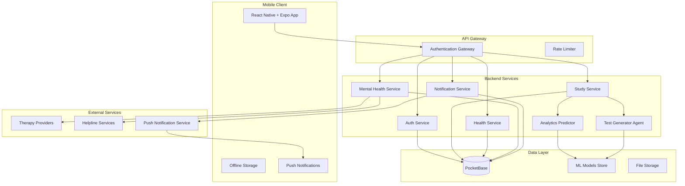

# Design Document: StudyFlow

## Overview

StudyFlow is a health-first exam preparation platform that combines adaptive learning technology with comprehensive wellness support for JEE & NEET students. The system architecture follows a microservices pattern with a React Native + Expo mobile frontend, Python backend services, PocketBase database, and integrated AI agents for intelligent content generation and performance prediction.

The core philosophy centers on preventing student burnout through mandatory wellness breaks, mental health support, and data-driven insights that balance academic progress with physical and psychological well-being. The system uses machine learning to predict performance trajectories and LangGraph agents to generate adaptive assessments.

## Architecture

### High-Level Architecture



### Technology Stack

**Frontend:**
- React Native with Expo managed workflow for cross-platform mobile development
- Expo Router for navigation and deep linking
- React Context for state management
- AsyncStorage for offline data persistence
- Expo Notifications for push notifications

**Backend:**
- Python with FastAPI for REST API services
- LangGraph for AI agent orchestration and test generation
- Scikit-learn with Gradient Boosting for performance prediction
- Pandas and NumPy for data processing
- Matplotlib and Seaborn for analytics visualization

**Database:**
- PocketBase as primary database with real-time subscriptions
- Built-in authentication and file storage
- Automatic API generation and admin dashboard

**AI/ML Stack:**
- LangGraph agents for adaptive test generation
- XGBoost/LightGBM for performance prediction models
- Content-based filtering for health recommendations
- Natural language processing for syllabus parsing

## Components and Interfaces

### Authentication Service

**Purpose:** Manages user authentication, session handling, and security

**Key Components:**
- JWT token management with refresh token rotation
- PocketBase integration for user data persistence
- Session validation middleware
- Password security with bcrypt hashing

**Interfaces:**
```python
class AuthService:
    def authenticate_user(email: str, password: str) -> AuthResult
    def refresh_token(refresh_token: str) -> TokenPair
    def validate_session(access_token: str) -> UserSession
    def logout_user(user_id: str) -> bool
```

### Syllabus Manager

**Purpose:** Handles syllabus upload, parsing, and progress tracking

**Key Components:**
- Document parser for PDF/text syllabus files
- Topic extraction using NLP techniques
- Progress calculation and visualization
- Hierarchical topic organization

**Interfaces:**
```python
class SyllabusManager:
    def parse_syllabus(file_data: bytes, exam_type: ExamType) -> SyllabusStructure
    def update_topic_status(user_id: str, topic_id: str, status: TopicStatus) -> bool
    def get_progress_summary(user_id: str) -> ProgressSummary
    def get_incomplete_topics(user_id: str) -> List[Topic]
```

### Study Planner

**Purpose:** Generates adaptive study schedules with health-first approach

**Key Components:**
- Adaptive scheduling algorithm considering performance data
- Health break enforcement (max 6 consecutive study days)
- Learning/revision/mock/break day categorization
- Integration with health module for activity scheduling

**Interfaces:**
```python
class StudyPlanner:
    def generate_study_plan(user_id: str, target_date: datetime) -> StudyPlan
    def adapt_plan_based_on_performance(user_id: str, performance_data: PerformanceData) -> StudyPlan
    def enforce_health_breaks(plan: StudyPlan) -> StudyPlan
    def get_daily_schedule(user_id: str, date: datetime) -> DailySchedule
```

### Test Generator Agent (LangGraph)

**Purpose:** Creates adaptive tests using AI agents with graph-based workflows

**Key Components:**
- LangGraph state machine for test generation workflow
- Question difficulty adaptation based on performance
- JEE/NEET pattern alignment
- Explanation generation for solutions

**Graph Structure:**


**Interfaces:**
```python
class TestGeneratorAgent:
    def generate_weekly_test(user_id: str, week_date: datetime) -> GeneratedTest
    def adapt_difficulty(user_performance: PerformanceHistory) -> DifficultyLevel
    def create_explanations(questions: List[Question]) -> List[Explanation]
    def validate_test_quality(test: GeneratedTest) -> ValidationResult
```

### Analytics Engine

**Purpose:** Provides ML-based performance prediction and insights

**Key Components:**
- Gradient Boosting models (XGBoost/LightGBM) for performance prediction
- Feature engineering from study patterns and test results
- Early warning system for at-risk students
- Visualization generation for progress tracking

**Interfaces:**
```python
class AnalyticsEngine:
    def predict_exam_readiness(user_id: str) -> PredictionResult
    def analyze_performance_trends(user_id: str) -> TrendAnalysis
    def generate_early_warnings(user_id: str) -> List[Warning]
    def create_performance_visualizations(user_id: str) -> VisualizationData
```

### Health Module

**Purpose:** Manages wellness recommendations and health tracking

**Key Components:**
- TDE (Total Daily Energy) calculation
- Content-based diet recommendation system
- Activity scheduling and reminder system
- Health data tracking and analysis

**Interfaces:**
```python
class HealthModule:
    def calculate_tde(user_profile: UserProfile, activity_level: ActivityLevel) -> float
    def recommend_diet(tde: float, study_intensity: StudyIntensity) -> DietPlan
    def schedule_activities(daily_schedule: DailySchedule) -> ActivitySchedule
    def track_health_metrics(user_id: str, metrics: HealthMetrics) -> bool
```

### Mental Health System

**Purpose:** Provides psychological support and crisis intervention

**Key Components:**
- Therapist booking and payment system
- Psychological assessment tools (validated screening instruments)
- Crisis detection and helpline integration
- Secure communication channels for therapy sessions

**Interfaces:**
```python
class MentalHealthSystem:
    def book_therapy_session(user_id: str, preferences: TherapyPreferences) -> BookingResult
    def conduct_psychological_assessment(user_id: str) -> AssessmentResult
    def detect_crisis_indicators(assessment: AssessmentResult) -> CrisisLevel
    def connect_to_helpline(user_id: str, crisis_level: CrisisLevel) -> HelplineConnection
```

## Data Models

### User Profile
```python
@dataclass
class UserProfile:
    user_id: str
    email: str
    name: str
    exam_type: ExamType  # JEE or NEET
    target_exam_date: datetime
    current_class: int
    health_profile: HealthProfile
    study_preferences: StudyPreferences
    created_at: datetime
    updated_at: datetime
```

### Study Plan
```python
@dataclass
class StudyPlan:
    plan_id: str
    user_id: str
    start_date: datetime
    end_date: datetime
    daily_schedules: List[DailySchedule]
    health_breaks: List[HealthBreak]
    adaptation_history: List[AdaptationEvent]
    created_at: datetime
```

### Test Result
```python
@dataclass
class TestResult:
    result_id: str
    user_id: str
    test_id: str
    score: float
    time_taken: int  # seconds
    topic_scores: Dict[str, float]
    difficulty_level: DifficultyLevel
    completed_at: datetime
```

### Health Metrics
```python
@dataclass
class HealthMetrics:
    user_id: str
    date: datetime
    sleep_hours: float
    stress_level: int  # 1-10 scale
    hydration_glasses: int
    physical_activity_minutes: int
    mood_rating: int  # 1-10 scale
```

### Performance Prediction
```python
@dataclass
class PerformancePrediction:
    user_id: str
    prediction_date: datetime
    exam_readiness_score: float  # 0-1
    topic_readiness: Dict[str, float]
    confidence_interval: Tuple[float, float]
    risk_factors: List[RiskFactor]
    recommendations: List[str]
```

## Correctness Properties

*A property is a characteristic or behavior that should hold true across all valid executions of a system—essentially, a formal statement about what the system should do. Properties serve as the bridge between human-readable specifications and machine-verifiable correctness guarantees.*

### Property 1: Authentication Access Control
*For any* StudyFlow feature access attempt, authentication should be required and only valid credentials should grant access, while invalid credentials should be rejected with appropriate error messages and session expiry should preserve work state.
**Validates: Requirements 1.1, 1.2, 1.3, 1.4**

### Property 2: Syllabus Processing and Progress Tracking
*For any* uploaded syllabus document, the system should parse it into structured topics, accurately track completion status changes, calculate progress percentages correctly, and support both JEE and NEET formats.
**Validates: Requirements 2.1, 2.2, 2.3, 2.4, 2.5**

### Property 3: Adaptive Study Planning with Health Constraints
*For any* study plan generation, the system should create balanced schedules with all required day types, adapt based on performance data, allocate extra time for weak topics, integrate health activities, and never exceed 6 consecutive study days.
**Validates: Requirements 3.1, 3.2, 3.3, 3.4, 3.5**

### Property 4: Adaptive Test Generation
*For any* test generation request, the LangGraph agent should create time-appropriate assessments, adapt difficulty based on performance, focus on weak areas, align with exam patterns, and provide complete explanations.
**Validates: Requirements 4.1, 4.2, 4.3, 4.4, 4.5**

### Property 5: ML-Based Performance Analytics
*For any* performance analysis, the system should use Gradient Boosting algorithms for predictions, display comprehensive analytics including trends and strengths, provide probability estimates when data is sufficient, generate risk alerts, and create proper visualizations.
**Validates: Requirements 5.1, 5.2, 5.3, 5.4, 5.5**

### Property 6: Health Tracking and Recommendations
*For any* health data input, the system should calculate TDE accurately, provide personalized diet recommendations using content-based filtering, include mandatory health activities in schedules, trigger break reminders for prolonged sessions, and track all health metrics.
**Validates: Requirements 6.1, 6.2, 6.3, 6.4, 6.5**

### Property 7: Mental Health Support System
*For any* mental health interaction, the system should connect users to licensed therapists, process payments correctly, use validated assessment tools, provide immediate support for concerning results, maintain 24/7 helpline access, and ensure data encryption and privacy compliance.
**Validates: Requirements 7.1, 7.2, 7.3, 7.4, 7.5, 7.6**

### Property 8: Notification Management System
*For any* notification trigger, the system should display official notices prominently, send timely reminders for scheduled activities, provide wellness reminders for health breaks, send progressive deadline notifications, and allow customization while preserving mandatory health reminders.
**Validates: Requirements 8.1, 8.2, 8.3, 8.4, 8.5**

### Property 9: Data Synchronization and Persistence
*For any* user interaction, the system should store data persistently in PocketBase, synchronize complete state across devices, sync offline changes when connectivity returns, and resolve conflicts using timestamp-based resolution.
**Validates: Requirements 9.1, 9.2, 9.3, 9.4**

### Property 10: Cross-Platform Mobile Functionality
*For any* mobile platform interaction, the system should provide React Native + Expo interface, maintain responsive design across screen sizes, support offline access with proper caching and sync, use native notification systems, and ensure consistent experience across iOS and Android.
**Validates: Requirements 10.1, 10.2, 10.3, 10.4, 10.5**

## Error Handling

### Authentication Errors
- **Invalid Credentials**: Return standardized error responses with appropriate HTTP status codes
- **Session Expiry**: Implement graceful session renewal with state preservation
- **Rate Limiting**: Implement exponential backoff for failed authentication attempts
- **Account Lockout**: Temporary lockout after multiple failed attempts with recovery mechanism

### Data Processing Errors
- **Syllabus Parsing Failures**: Provide detailed error messages for unsupported formats with suggested corrections
- **ML Model Failures**: Implement fallback mechanisms when prediction models are unavailable
- **Test Generation Errors**: Retry logic with alternative question sources when LangGraph agent fails
- **Health Calculation Errors**: Validate input ranges and provide default recommendations when calculations fail

### Network and Sync Errors
- **Offline Mode**: Graceful degradation with local caching and queue-based sync
- **Sync Conflicts**: Timestamp-based resolution with user notification for manual resolution when needed
- **API Timeouts**: Retry mechanisms with exponential backoff and circuit breaker patterns
- **Data Corruption**: Integrity checks with automatic backup restoration

### External Service Errors
- **Therapy Booking Failures**: Alternative therapist suggestions and rescheduling options
- **Payment Processing Errors**: Clear error messages with retry mechanisms and alternative payment methods
- **Notification Delivery Failures**: Fallback to in-app notifications when push notifications fail
- **Helpline Unavailability**: Automated crisis resources and emergency contact information

## Testing Strategy

### Dual Testing Approach

The testing strategy employs both unit testing and property-based testing as complementary approaches:

**Unit Tests:**
- Focus on specific examples, edge cases, and error conditions
- Test integration points between components
- Validate concrete scenarios and boundary conditions
- Ensure proper error handling and user feedback

**Property-Based Tests:**
- Verify universal properties across all inputs using randomized test data
- Validate correctness properties defined in the design document
- Test system behavior under various input combinations
- Ensure robustness across the entire input space

### Property-Based Testing Configuration

**Framework Selection:**
- **Python Backend**: Use Hypothesis for property-based testing
- **React Native Frontend**: Use fast-check for JavaScript property testing
- **Integration Tests**: Use Hypothesis with API testing frameworks

**Test Configuration:**
- Minimum 100 iterations per property test to ensure statistical confidence
- Each property test must reference its corresponding design document property
- Tag format: **Feature: studyflow, Property {number}: {property_text}**
- Seed-based reproducibility for debugging failed test cases

**Property Test Implementation:**
- Each correctness property must be implemented by a single property-based test
- Generate realistic test data that matches production data patterns
- Include edge cases in generators (empty inputs, boundary values, invalid data)
- Combine property tests with example-based tests for comprehensive coverage

### Test Categories

**Authentication Testing:**
- Property tests for access control across all features
- Unit tests for specific authentication flows and error cases
- Integration tests for session management and token refresh

**AI/ML Component Testing:**
- Property tests for LangGraph agent behavior and test generation
- Unit tests for ML model predictions and edge cases
- Performance tests for model inference times and accuracy

**Health and Wellness Testing:**
- Property tests for TDE calculations and diet recommendations
- Unit tests for health break enforcement and reminder systems
- Integration tests for mental health assessment workflows

**Data Persistence Testing:**
- Property tests for sync behavior and conflict resolution
- Unit tests for offline mode and data integrity
- Load tests for concurrent user scenarios and data consistency

**Mobile Platform Testing:**
- Property tests for cross-platform consistency
- Unit tests for platform-specific features and notifications
- UI tests for responsive design across device sizes

### Continuous Integration

**Automated Testing Pipeline:**
- Run all unit tests and property tests on every commit
- Separate test suites for different components with parallel execution
- Performance regression testing for ML models and API endpoints
- Security testing for authentication and data encryption

**Test Data Management:**
- Synthetic data generation for property tests
- Anonymized production data for integration testing
- Separate test databases for different test environments
- Automated test data cleanup and refresh procedures